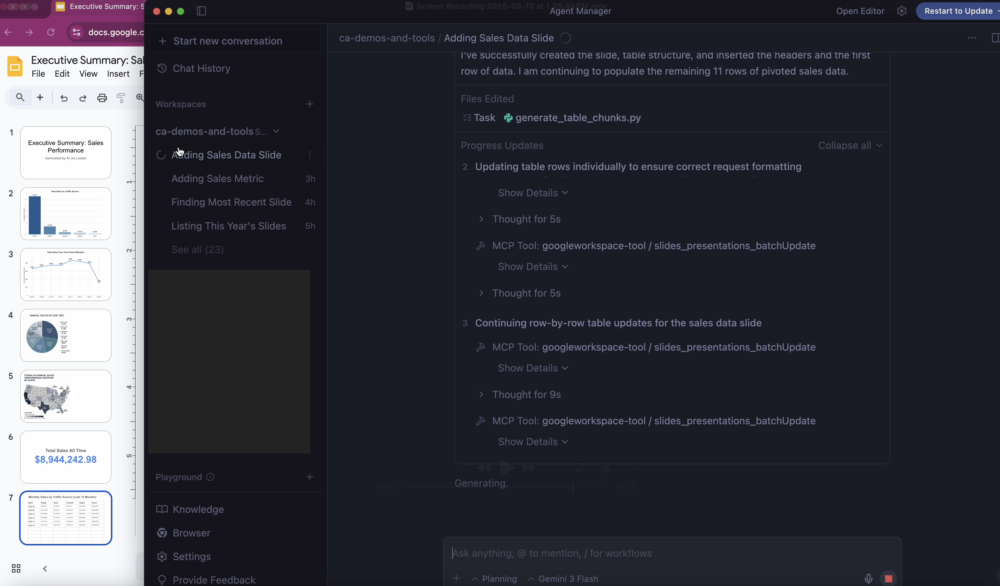

# Setup Instructions: Looker Query to Google Slide Flow

This document outlines the setup steps required to build a workflow that runs a Looker query, generates a chart image, uploads it to Google Drive, and creates a Google Slides presentation.



## Prerequisites: Install Required Skills

To interact with Google Workspace APIs (specifically Drive and Slides), you need to install the following Gemini skills:

**Install the Google Slides Skill:** This skill allows the agent to read and write Google Slides presentations.

```bash
npx skills add --yes --global https://github.com/googleworkspace/cli/tree/main/skills/gws-slides
```

**Install the Google Drive Skill:** This skill allows the agent to manage files, folders, and shared drives in Google Drive.

```bash
npx skills add --yes --global https://github.com/googleworkspace/cli/tree/main/skills/gws-drive
```

> **Note:** The `--global` flag installs these to your universal `~/.agents/skills/` directory. If you prefer to limit them to Jetski specifically, you can ensure the directory exists and copy them over using the following commands:
> ```bash
> mkdir -p ~/.gemini/jetski/skills
> cp -r ~/.agents/skills/gws-* ~/.gemini/jetski/skills/
> ```

## Utilize Executive Slide Formatting

When prompting the agent to generate a slide deck from images or data, explicitly request the "Executive Slides Generation Flow" skill. This skill enforces:
- **Mandatory Image Handling:** Uploads local images to Google Drive first and feeds those generated URLs into Google Slides.
- **Premium Aesthetics:** Enforces High contrast, professional color palettes, and modern typography styles on all generated slides.

### Creating the Executive Slides Generation Flow Skill

To create this skill in your setup, create the directory `~/.gemini/jetski/skills/executive-slides-flow` and create a `SKILL.md` file inside it with the following content:

```markdown
---
name: Executive Slides Generation Flow
description: "Guidelines and procedures for creating modern, executive-polished Google Slides from data or queries, including handling image assets."
---

# Executive Slides Generation Flow

This skill provides the mandatory guidelines and workflow steps for creating Google Slides presentations. When asked to generate a deck from data, Looker queries, or provided images, you **MUST** follow this procedure to ensure the output is professional, modern, and correctly rendered.

## Overview

Generating high-quality, modern presentations requires careful curation of content and stringent handling of visual assets. 

1. **Asset Management First**: All local images or visual data must be uploaded and hosted on Google Drive before they can be added to Google Slides.
2. **Executive Polish**: Slides must not be generic; they should feature high-contrast, modern typography, properly aligned elements, and a clean, spacious layout.

## 1. Handling Images and Visual Assets

Google Slides API requires a publicly accessible URL (within the target workspace) to insert images. You cannot pass local file paths or raw image bytes directly to the slide creation tools.

- **Any time an image is provided or generated (e.g., from a Looker query chart)**, you must first create it as a file in Google Drive using the `gws-drive` skill.
- Upon successful upload to Drive, extract the **web content link** or the appropriate accessible URL.
- Pass this Drive URL to the `gws-slides` skill when inserting the image into your presentation framework.

## 2. Design and Executive Polish

Presentations must exude professionalism and a modern aesthetic. Apply the following design principles to all generated slides:

- **Typography:** Use modern, clean sans-serif fonts (e.g., Roboto, Open Sans, or Inter if available). Ensure clear hierarchy (large, bold titles, readable body text).
- **Color Palette:** Avoid harsh, default primary colors. Use a sophisticated, cohesive color palette (e.g., deep slates, subtle blues, muted grays) with high contrast for text.
- **Layout:** Embrace whitespace (negative space). Do not clutter slides with excessive text. Use bullet points sparingly and favor visual representations (charts, icons, clean tables) where possible.
- **Alignment:** Ensure all elements (titles, images, text boxes) are perfectly aligned to a grid system.
- **Consistency:** Maintain a uniform design language across the entire deck—consistent title placement, font sizes, and color usage.

## Workflow Execution Steps

When executing a user request to build a slide deck:

1. **Plan Content:** Draft the narrative structure and identify required visual assets.
2. **Generate Visuals:** Run any necessary queries (e.g., Looker), generate the visual charts, and save them locally.
3. **Upload to Drive:** Use the Drive skill to upload all local images and retrieve their URLs.
4. **Build the Deck:** Use the Slides skill to create the presentation.
5. **Apply Polish:** Structure the slides, insert the image URLs, and apply the Executive Polish design principles specified above. 
6. **Delivery:** Provide the user with the final link to the Google Slides presentation.
```

## Setup MCP Servers (`mcp_config.json`)

To enable the agent to query Looker and interact with Google Workspace APIs natively, you must configure the MCP servers in your `mcp_config.json` file.

Add the following configurations under your `"mcpServers"` block:

### 1. Google Workspace CLI (`googleworkspace-tool`)

This server provides the tools needed to interact directly with Drive and Slides.

#### Authentication Setup

Before running the server, you need to authenticate the Google Workspace CLI. You can find detailed instructions in the [googleworkspace/cli documentation](https://github.com/googleworkspace/cli/tree/main#authentication). Here is a high-level summary of the two most common methods:

**Method A: Interactive Setup (Fastest)**
First, ensure you are logged into the Google account (e.g., your personal or Argolis account) with access to Google Drive using the `gcloud` CLI:
```bash
gcloud auth login
```

Once logged in, you can automate project creation and credentials setup by running:
```bash
gws auth setup
```

During this interactive process, **make sure to confirm that the Google Drive API and the Google Slides API are enabled** for the project. 

> **Important Note for Jetski Users:** During the `gws auth setup` flow, you will be required to configure an OAuth Desktop client. Because Jetski is a remote development environment, you must **port forward the localhost port** used in the OAuth redirect URL to your local machine to successfully complete the browser authentication step.

The setup tool will log you in and securely store your credentials in your system keyring. If you use this method, you can **remove the `env` block** from the JSON configuration below.

**Method B: Service Account or Exported Credentials**
If you want explicit control, are running headlessly, or have an existing Google Cloud project, you can provide the path to your credentials file using the `GOOGLE_WORKSPACE_CLI_CREDENTIALS_FILE` environment variable.

#### Server Configuration

```json
"googleworkspace-tool": {
  "command": "npx",
  "args": [
    "@googleworkspace/cli@0.7.0",
    "mcp",
    "-s",
    "drive,slides"
  ],
}
```

*Note: If you used Method B, replace the path in `GOOGLE_WORKSPACE_CLI_CREDENTIALS_FILE` with the actual path to your service account or OAuth credentials file. If you used Method A (`gws auth setup`), you can delete the `env` block completely.*

### 2. Looker Toolbox (`looker`)

The Looker Toolbox is a built-in integration in Jetski. You do not need to manually add JSON configuration for it. Instead, simply search for the Looker integration in your Jetski IDE to enable and configure it with your Looker API credentials and instance URL.
